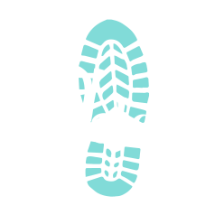

<!-- <div style="display: flex; flex-direction: column; justify-content: center;"> -->
<div style="position: relative;">

<div style="align-self: flex-start;>
<h1 style="color: white"> Project Atelier | Sole Inc. </h1>

<div align="left">


</div>
<br></br>
<div align="center">
  
</div>
<div style="display: flex; flex-direction: row; align-items: center;">
 <h2 style="color:#81DBD8"> About Project Atelier: </h2>
</div>

Our team was tasked with creating a complete redesign of an outadated client-facing retail web-portal including but not limited to branding, and website functionality. This project comprises a complete redesign of the retail portal intended to address the client's concerns and modernize the site. This document outlines the design and features our team implemented.

<hr style="background-color: #5c5c5c;height: 2.0px;"/>

<p align="center">
<a href="#overview" style="color: white">Overview</a> |
<a href="#questions--answers" style="color: white">Questions & Answers</a> |
<a href="#ratings--reviews" style="color: white">Ratings & Reviews</a> |
<a href="#installation" style="color: white">Installation</a> |
<a href="#git-work-flow" style="color: white">Git Work Flow</a> |
<a href="#dependencies" style="color: white">Dependencies</a> |
<a href="#testing" style="color: white">Testing</a>
</p>

<hr style="background-color: #5c5c5c;height: 2.0px;"/>

<h2 style="color:#81DBD8"> Components </h2>

This section provides a broad overview of just a few of the exciting functionalities our team implemented for the Sole incorpertated product detail page.

The product detail page shows relevant information for a single product in the catalog. One single product can be associated with many sizes and styles which each result in unique SKUs (stock keeping units). The product detail page presents items at the product level. Further breakdown by style or size is only reflected within the product detail page.

The same product detail page is shown for every product in the catalog. Upon navigating to the product detail page or selecting a new product to display, the contents of the page updates to show information relevant to the selected product.

The item detail page consists of three distinct modules.

- Overview
- Ratings & Reviews
- Questions & Answers

### Overview

The Overview module is the top-most module on the Product Detail page. The functionality contained within this module can be divided into several pieces:

- Image gallery
- Product information
- Style selector
- Add to cart

This component guides the customer through selecting a specific style and size to add to their cart.

#### Image Gallery | Expanding Product Carousel & Vertical Thumbnail Gallery


The largest piece of the Overview module is the photo gallery which shows images of the product. The photos presented in this gallery are specific to the currently selected product style. Each time a new style is chosen, the gallery updates to show photos corresponding to the new style. Each style has a set of images associated with it and the gallery allows customers to browse between and zoom in on these photos.

The gallery is viewable in two states. A default collapsed view, and an expanded view.

#### Product Information | Style Selector


Below the product information panel, the user is presented with all the styles of the product and has the ability to toggle between them. Each style is displayed as an array of circular thumbnails.

All styles are displayed for the current product at all times. There is no limit to the number of styles a product can have. The thumbnails appear in rows of 4.

The current selection is indicated within the list by the overlay of a checkmark on top of the thumbnail for that style. Additionally, the title for that style appears typed out in full above the thumbnail list.

A user is able to change the selected style by clicking on the thumbnail displaying that style. Clicking on the thumbnail for the currently selected style has no impact.

By default, the style selected is first in the list and only one style can be selected at a time.

#### Product Information | Automatic Scrolling


General information about the product is displayed at the top of the Overview component. The following information is shown:

- Star Rating (# of Reviews)
  - Each product has an average rating based on its reviews. The average rating of the product is represented by an array of solid or outlined stars, where the number of solid stars represents the review score. The number of stars filled in coresponds to the average score.
  - The visual for rating is representative of up to a quarter of a review point. For example, if the average is 3.8, this will display as 3¾ solid stars and 1¼ outlined stars.
- Next to the star rating, a link stating “Read all [#] reviews” is shown Clicking this link automatically scrolls the page to the Ratings & Reviews component

### Questions & Answers

### Ratings & Reviews

#### Star Filter

## 

- talk about things here

<hr style="background-color: #5c5c5c;height: 2.0px;"/>

<h2 style="color:#81DBD8"> Installation: </h2>

Getting your own copy of Project Atelier is easy!

- Fork and clone this repo to your local machine
- Run npm install to install dependencies
- Read about the following scripts to understand their functionality
- Enjoy!

### Scripts

The following scripts can be found in package.json

<hr style="background-color: #5c5c5c;height: 2.0px;"/>

`npm run server-dev`

<i> Launches nodemon to watch the server path and serve static files </i>

`npm run dev`

<i> Launches webpack to bundle your webapp and watch for any changes </i>

`npm run start`

<i> Bundles your webpack in development mode </i>

`npm run build`

<i> Bundles your webpack in production mode </i>

`npm run test`

<i> Calls jest to run any user defined tests </i>

```
// in package.json

"scripts": {
    "server-dev": "npx nodemon --watch server server/server.js",
    "dev": "npx webpack --watch",
    "start": "Webpack --mode=development",
    "build": "webpack --mode=production",
    "test": "jest"
  },
```

<hr style="background-color: #5c5c5c;height: 2.0px;"/>

<h2 style="color:#81DBD8"> Git Work Flow </h2>

### Steps

1. Fork the repo
2. Clone the repo
3. Create a branch to work on

```jsx
git checkout -b some-new-branch
```

1. Before push. . .

```jsx
git status // checks the status of changes
git add --a // adds all the changes
// you can also specifiy the specific file rather than -a
git commit -a -m /* commits all the changes staged and adds the same
message to all of them, you can also be more specific without the -a */
```

2. Push to the branch you are working on

```jsx
git push origin some-new-branch
```

- Other useful branch commands

  ```jsx
  git remote -v // lists the branches available
  git branch // shows the current branch you are working on
  ```

3. Create a Pull Request from your branch on Github with a message asking for approval
4. If your master branch is behind

   - switch branch to master

   ```jsx
   git status // checks status of updates
   git checkout master // changes to the master branch
   git pull origin master /* pulls the changes from github to your local
   master branch */
   ```

5. For a new task, Create a new branch as before

```jsx
git checkout -b a-second-new-branch

// make changes //
// save //
git status // check status
git add --a // add all the changes
git commit -a -m // commit all changes and add message to all
git push origin a-second-new-branch // push to the feature branch you created
// create another pull request on github
```

1. Check on first pull request

   1. if any changes are requested
      1. create a new feature branch
      2. fix any changes requested
      3. save, add, commit push
   2. update will show automatically on Github in original pull request (as long as its still open)
      1. Make another comment on changes
   3. Once merge is approved

      1. if there are no merge conflicts
         1. confirm merge on github
         2. Good Practice: delete the branch after merge
      2. if there _are_ merge conflicts

         1. Fix the conflicts

         ```jsx
         git merge master  /* attempt to merge the master branch
         into the branch you are currently on. This will show you
         the conflicts you need to fix. */
         ```

         1. After conflicts are fixed
            1. add, commit (commit? push?)
            2. complete merge on github

<hr style="background-color: #5c5c5c;height: 2.0px;"/>

<h2 style="color:#81DBD8"> Testing: </h2>

Our team decided on Jest as our testing framework. Jest has a variety of testing solutions, some of which have also been installed for an easier testing experience. Links on how to get started have been included below.

- <a href="https://jestjs.io/docs/getting-started" style="color: white; text-decoration: underline;">Jest</a>
- <a href="https://mswjs.io/docs/getting-started/install" style="color: white; text-decoration: underline;">Mock Service Worker (MSW)</a>
- <a href="https://testing-library.com/docs/react-testing-library/intro" style="color: white; text-decoration: underline;">React Testing Library (RTL)</a>
  - <a href="https://www.robinwieruch.de/react-testing-library/" style="color: white; text-decoration: underline;">RTL Tutorial</a>
- <a href="https://jestjs.io/docs/puppeteer" style="color: white; text-decoration: underline;">Puppeteer</a>
- <a href="https://reactjs.org/docs/test-utils.html" style="color: white; text-decoration: underline;">Included React Test Utilities</a>

<hr style="background-color: #5c5c5c;height: 2.0px;"/>

<h2 style="color:#81DBD8"> Contributors </h2>

<table >
    <td align="center">
        <a href="https://github.com/mayliang021" style="color: white; text-decoration: none;">
            
            <br />
            <sub>
                <b><span style="color: white"> May L.</span> | <span style="color: #81DBD8"> mayliang021</span></b>
            </sub>
        </a>
        <br /><br>
        <a href="https://github.com/TitanInSpirit/Project_Atelier/pulls?q=is%3Apr+is%3Aclosed+author%3Amayliang021" title="Commits">💻</a> &nbsp;
        <a href="https://github.com/TitanInSpirit/Project_Atelier/tree/main/src/components/ratingsAndReviews" title="Component">📖</a> &nbsp;
    </td>
    <td align="center">
        <a href="https://github.com/sbirvin1s" style="color: white; text-decoration: none;">
            
            <br />
            <sub>
                <b><span style="color: white"> Sam I. </span> | <span style="color: #81DBD8">sbirvin1s</span></b>
            </sub>
        </a>
        <br /><br>
        <a href="https://github.com/TitanInSpirit/Project_Atelier/pulls?q=is%3Apr+is%3Aclosed+author%3Asbirvin1s" title="Commits">💻</a> &nbsp;
        <a href="https://github.com/TitanInSpirit/Project_Atelier/tree/main/src/components/questions" title="Component">📖</a> &nbsp;
    </td>
    <td align="center">
        <a href="https://github.com/Symphon-y" style="color: white; text-decoration: none;">
            
            <br />
            <sub>
                <b><span style="color: white"> Travis R. </span> | <span style="color: #81DBD8"> Travis R. </span></b>
            </sub>
        </a>
        <br /><br>
        <a href="https://github.com/TitanInSpirit/Project_Atelier/pulls?q=is%3Apr+is%3Aclosed+author%3ASymphon-y" title="Commits">💻</a> &nbsp;
        <a href="https://github.com/TitanInSpirit/Project_Atelier/tree/main/src/components/overview" title="Component">📖</a> &nbsp;
    </td>
<table>
</div>
    <div style="position: absolute; top: 150vw; left: -8vw; opacity: .04; background-image: url(Assets/leftFoot.svg); background-repeat: no-repeat; transform: scale(100);">
    &nbsp;
    </div>
        <div style="position: absolute; top: 400vw; margin-left: 90vw; opacity: .04; background-image: url(Assets/Favicon.svg); background-repeat: no-repeat; transform: scale(100);">
    &nbsp;
    </div>
        <div style="position: absolute; top: 850vw; left: -8vw; opacity: .04; background-image: url(Assets/leftFoot.svg); background-repeat: no-repeat; transform: scale(100);">
    &nbsp;
    </div>
</div>
